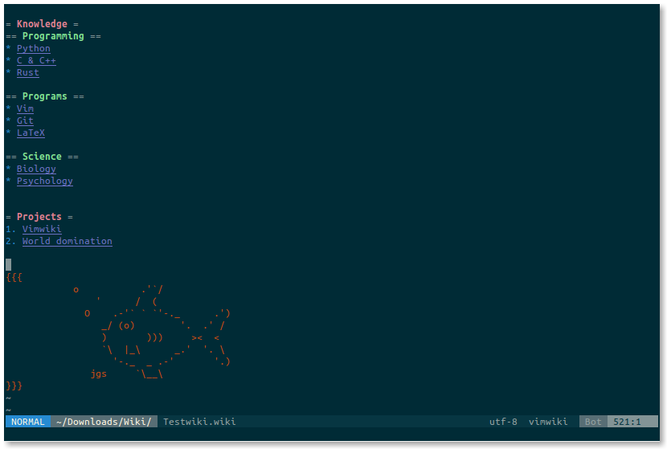
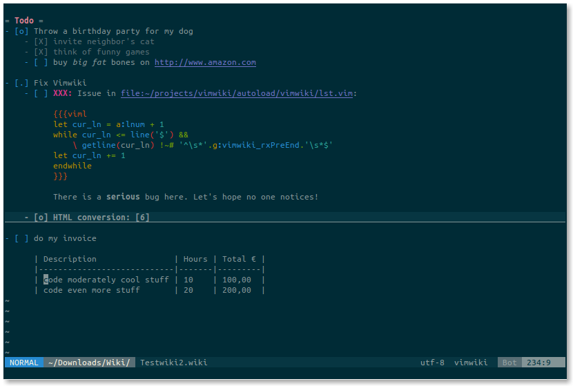

一个私人的维基——vim插件
==============================================================================

介绍
------------------------------------------------------------------------------

Vimwiki是私人维基的vim插件 -- 许多有自己代码高亮的text文件。

通过Vimwiki，你可以:

 * 组织笔记和想法
 * 制作代办事项表
 * 写文档

一个快速的开始，通常使用`<Leader>ww`(一般是`\ww`)，然后创建你的index wiki文件。
通常，它在:

    ~/vimwiki/index.wiki

在这个文件，输入如下的例子：

    = My knowledge base =
        * Tasks -- things to be done _yesterday_!!!
        * Project Gutenberg -- good books are power.
        * Scratchpad -- various temporary stuff.

将你的光标放到`Tasks`（任务）上，并且按回车键去创建一个链接。一旦按下，`Task`将会
变成`[[Tasks]]` -- 一个vimwiki的链接。再按一次回车去打开它。编辑文件，保存它，
然后按backspace来返回你的index。

一个vimwiki链接可以一句话创建。只需要通过选择visual模式选择这个句子，然后按回车。
你可以通过选择`Project Gutenberg`来尝试。结果像是这个样子：

    = My knowledge base =
        * [[Tasks]] -- things to be done _yesterday_!!!
        * [[Project Gutenberg]] -- good books are power.
        * Scratchpad -- various temporary stuff.

基本标记
------------------------------------------------------------------------------

    = Header1 =
    == Header2 ==
    === Header3 ===

    *bold* -- bold text
    _italic_ -- italic text

    [[wiki link]] -- wiki link
    [[wiki link|description]] -- wiki link with description

列表:

    * bullet list item 1
        - bullet list item 2
        - bullet list item 3
            * bullet list item 4
            * bullet list item 5
    * bullet list item 6
    * bullet list item 7
        - bullet list item 8
        - bullet list item 9

    1. numbered list item 1
    2. numbered list item 2
        a) numbered list item 3
        b) numbered list item 4

查看`:h vimwiki-syntax`

键位绑定
------------------------------------------------------------------------------

normal 模式:

 * `<Leader>ww` -- 打开默认的wiki index文件
 * `<Leader>wt` -- 通过tab实现上一个功能
 * `<Leader>ws` -- 选择并且打开index文件
 * `<Leader>wd` -- 删除进入的wiki文件
 * `<Leader>wr` -- 重命名你进入的wiki文件
 * `<Enter>` -- 进入/创建 wiki 链接
 * `<Shift-Enter>` -- 通过分屏模式sp，进入/创建wiki链接
 * `<Ctrl-Enter>` -- 通过分屏模式vs，进入/创建wiki链接
 * `<Backspace>` -- 返回父节点
 * `<Tab>` -- 寻找下一个wiki链接
 * `<Shift-Tab>` -- 寻找上一个wiki链接

查看`:h vimwiki-mappings`

命令
------------------------------------------------------------------------------

 * `:Vimwiki2HTML` -- 转换当前wiki成为html
 * `:VimwikiAll2HTML` -- 转化你的全部wiki到html
 * `:help vimwiki-commands` -- 显示全部命令

安装细节
==============================================================================

在安装之前，你需要做的
------------------------------------------------------------------------------

确定在`vimrc`中，你的设置是这样的。

    set nocompatible
    filetype plugin on
    syntax on

如果没有他们，Vimwiki将无法正常工作。

使用 pathogen (译者注：一个插件) (http://www.vim.org/scripts/script.php?script_id=2332 )
------------------------------------------------------------------------------

    cd ~/.vim
    mkdir bundle
    cd bundle
    git clone https://github.com/vimwiki/vimwiki.git

然后启动vim，使用`:Helptags` 然后 `:help vimwiki`来确保他已经被安装了。
